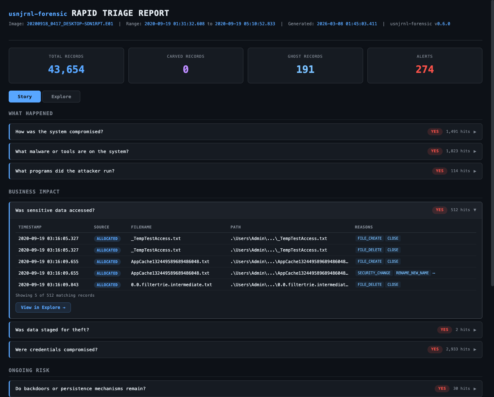
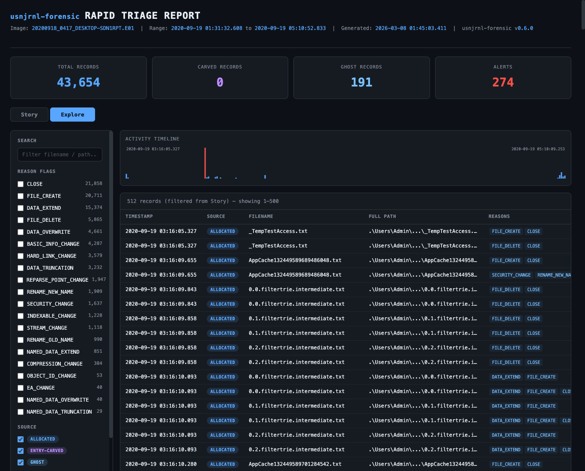
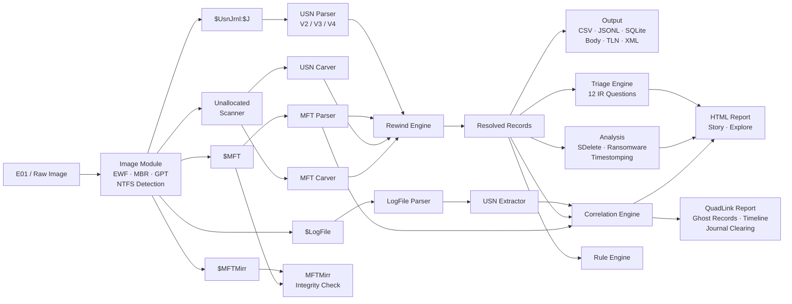

# usnjrnl-forensic

[](https://crates.io/crates/usnjrnl-forensic)
[](LICENSE)
[](https://github.com/SecurityRonin/usnjrnl-forensic)
[](https://github.com/sponsors/h4x0r)

Point this at an E01. Get a triage report in 35 seconds.

12 questions answered. 55,000+ records analyzed. 12,000 deleted records recovered from unallocated space. One self-contained HTML file you open in your browser and hand to your incident commander.

### Demo: [Szechuan Sauce](https://dfirmadness.com/the-stolen-szechuan-sauce/) CTF

```bash
usnjrnl-forensic --image DESKTOP-SDN1RPT.E01 --carve-unallocated --report triage.html
```

35 seconds later:

[](https://securityronin.github.io/usnjrnl-forensic/docs/demo/szechuan-sauce-triage.html)

**The Story tab answers 12 IR questions in seconds.** Was the system compromised? What malware is present? Were credentials stolen? Did the attacker destroy evidence? Click any question to see the matching records.

[](https://securityronin.github.io/usnjrnl-forensic/docs/demo/szechuan-sauce-triage.html)

**The Explore tab is a full timeline workbench.** 55,809 records with search, filters by reason flag, source pill filtering (allocated/entry-carved/ghost), activity sparkline, and paginated results. Every record shows its origin: purple "ENTRY-CARVED" pills for journal entries recovered from unallocated space, red "GHOST" pills for records found in `$LogFile` but wiped from `$UsnJrnl`.

> [View the live report](https://securityronin.github.io/usnjrnl-forensic/docs/demo/szechuan-sauce-triage.html). Generated from the [Szechuan Sauce DFIR CTF](https://dfirmadness.com/the-stolen-szechuan-sauce/) desktop image ([download the E01](https://dfirmadness.com/the-stolen-szechuan-sauce/), 6.4 GB).

### What "recovered" means

The "12,346 recovered records" in the report are USN journal entries carved from unallocated disk space and `$LogFile`. Each entry proves a file existed at a specific path, at a specific time, with a specific operation (create, delete, rename, data write). This is metadata recovery. The file's data blocks are a separate matter. Those clusters may have been overwritten. Carved USN entries give you the *what, when, and where* of file activity the attacker tried to erase. They do not guarantee the file content is still on disk.

To recover actual file data from carved MFT entries, you would feed the MFT record into a tool like `icat` or `tsk_recover` and check whether the data runs are still intact. `usnjrnl-forensic` tells you which files to look for. Data recovery tools tell you whether the bits survived.

## What it does

`usnjrnl-forensic` opens E01 forensic images directly, extracts four NTFS artifacts (`$UsnJrnl`, `$MFT`, `$LogFile`, `$MFTMirr`), reconstructs full file paths through MFT entry reuse, carves deleted records from unallocated space, and runs 12 forensic triage questions against the results.

```
$ usnjrnl-forensic --image evidence.E01 --carve-unallocated --report triage.html

[*] Opening disk image: evidence.E01
[+] 847,293 USN records parsed
[+] 112,448 MFT entries parsed
[+] 5,378 USN records recovered from $LogFile
[+] 771 ghost records found in $LogFile (not present in $UsnJrnl)
[+] Carved 1,247 USN records + 89 MFT entries from unallocated space
[+] All paths fully resolved (0 UNKNOWN)
[+] Triage report written to triage.html
```

## Install

```bash
cargo install usnjrnl-forensic --features image
```

This gives you the `usnjrnl-forensic` binary with E01/raw disk image support. Runs on Windows, macOS, and Linux. No runtime dependencies.

Without image support (pre-extracted artifacts only):

```bash
cargo install usnjrnl-forensic
```

### Build from source

```bash
git clone https://github.com/SecurityRonin/usnjrnl-forensic
cd usnjrnl-forensic
cargo build --release --features image
```

### As a library

```toml
[dependencies]
usnjrnl-forensic = "0.6"
```

Available modules: `usn`, `mft`, `rewind`, `logfile`, `mftmirr`, `correlation`, `analysis`, `triage`, `rules`, `refs`, `monitor`, `image`, `output`.

## Usage

### Rapid triage (recommended starting point)

Point at an E01, get an HTML report:

```bash
usnjrnl-forensic --image evidence.E01 --carve-unallocated --report triage.html
```

The report is a self-contained HTML file. Open it in any browser. The **Story** tab answers 12 IR questions. The **Explore** tab gives you the full timeline with search, filters, and sparkline.

### Timeline export

```bash
usnjrnl-forensic --image evidence.E01 --csv timeline.csv
usnjrnl-forensic --image evidence.E01 --carve-unallocated --sqlite analysis.db
```

Keep extracted artifacts for later use:

```bash
usnjrnl-forensic -i evidence.E01 --output-dir ./extracted --sqlite analysis.db
```

Works with raw (dd) disk images too:

```bash
usnjrnl-forensic --image disk.raw --csv output.csv
```

### From pre-extracted artifacts

#### Basic: parse $UsnJrnl with MFT path resolution

```bash
usnjrnl-forensic -j $J -m $MFT --csv output.csv
```

#### Full QuadLink analysis: correlate all four artifacts

```bash
usnjrnl-forensic -j $J -m $MFT --mftmirr $MFTMirr --logfile $LogFile --sqlite analysis.db
```

#### Detect timestomping

```bash
usnjrnl-forensic -j $J -m $MFT --detect-timestomping
```

#### All output formats at once

```bash
usnjrnl-forensic -j $J -m $MFT --csv out.csv --jsonl out.jsonl --sqlite out.db --body out.body --tln out.tln --xml out.xml
```

#### Journal-only mode (no MFT)

```bash
usnjrnl-forensic -j $J --csv output.csv
```

Paths will be partial (parent MFT entry numbers only). Useful when $MFT is unavailable.

## Why This Tool Exists

Every USN journal parser on the market has blind spots. MFTECmd produces "UNKNOWN" parent paths when MFT entries get reused. ntfs-linker requires C++ compilation and has no maintained builds. NTFS Log Tracker runs only on Windows. No single tool combines all the techniques documented in academic research and DFIR blog posts.

`usnjrnl-forensic` closes every gap. It implements the CyberCX Rewind algorithm for 100% path resolution, four-artifact QuadLink correlation (extending David Cowen's TriForce with $MFTMirr integrity verification), and adds forensic detection capabilities that no existing tool provides.

## Feature Comparison

How `usnjrnl-forensic` compares against every notable USN journal tool, past and present.

### Input & Parsing

| Feature | usnjrnl-forensic | MFTECmd | ANJP | ntfs-linker | NTFS Log Tracker | dfir_ntfs | CyberCX Rewind |
|---------|:-------:|:-------:|:----:|:-----------:|:----------------:|:---------:|:--------------:|
| E01 image support | Yes | No | No | No | No | No | No |
| Raw disk image support | Yes | No | No | No | No | No | No |
| USN V2 parsing | Yes | Yes | Yes | Yes | Yes | Yes | Via MFTECmd |
| USN V3 parsing | Yes | Yes | No | No | No | Yes | No |
| USN V4 parsing | Yes | No | No | No | No | Yes | No |
| ReFS support | Yes | No | No | No | No | No | No |

### Path Resolution & Correlation

| Feature | usnjrnl-forensic | MFTECmd | ANJP | ntfs-linker | NTFS Log Tracker | dfir_ntfs | CyberCX Rewind |
|---------|:-------:|:-------:|:----:|:-----------:|:----------------:|:---------:|:--------------:|
| **Artifacts analyzed** | **4** | **1** | **3** | **3** | **3** | **3** | **1** |
| MFT path resolution | Yes | Yes | Yes | Yes | Yes | Yes | Via MFTECmd |
| Rewind (reused MFT entries) | Yes | No | No | No | No | No | Yes |
| $LogFile USN extraction | Yes | No | Yes | Yes | Yes | Yes | No |
| TriForce correlation | Yes | No | Yes | Yes | Partial | Partial | No |
| Ghost record recovery | Yes | No | No | No | No | No | No |
| $MFTMirr integrity check | Yes | No | No | No | No | No | No |

> `usnjrnl-forensic` is the only tool that analyzes all four NTFS artifacts ($UsnJrnl + $MFT + $LogFile + $MFTMirr). We call this **QuadLink** correlation. It builds on David Cowen's TriForce (2013), which correlates three artifacts, and adds $MFTMirr byte-level integrity verification to detect tampering with critical system metadata.

### Forensic Detection

| Feature | usnjrnl-forensic | MFTECmd | ANJP | ntfs-linker | NTFS Log Tracker | dfir_ntfs | CyberCX Rewind |
|---------|:-------:|:-------:|:----:|:-----------:|:----------------:|:---------:|:--------------:|
| Timestomping detection | Yes | No | No | Basic | Basic | No | No |
| Anti-forensics detection | Yes | No | No | No | Basic | No | No |
| Ransomware pattern detection | Yes | No | No | No | No | No | No |
| USN record carving | Yes | No | No | No | Yes | No | No |
| MFT entry carving | Yes | No | No | No | No | No | No |
| Custom rule engine | Yes | No | No | No | No | No | No |

### Performance & Monitoring

| Feature | usnjrnl-forensic | MFTECmd | ANJP | ntfs-linker | NTFS Log Tracker | dfir_ntfs | CyberCX Rewind |
|---------|:-------:|:-------:|:----:|:-----------:|:----------------:|:---------:|:--------------:|
| Parallel processing | Yes | No | No | No | No | No | No |
| Real-time monitoring | Yes | No | No | No | No | No | No |

### Output Formats

| Feature | usnjrnl-forensic | MFTECmd | ANJP | ntfs-linker | NTFS Log Tracker | dfir_ntfs | CyberCX Rewind |
|---------|:-------:|:-------:|:----:|:-----------:|:----------------:|:---------:|:--------------:|
| CSV | Yes | Yes | No | No | Yes | Yes | No |
| JSON/JSONL | Yes | Yes | No | No | No | Yes | No |
| SQLite | Yes | No | Yes | Yes | Yes | No | Yes |
| Sleuthkit body | Yes | Yes | No | No | No | No | No |
| TLN | Yes | No | No | No | No | No | No |
| XML | Yes | No | No | No | No | No | No |
| HTML Report | Yes | No | No | No | No | No | No |

### Platform & Implementation

| | usnjrnl-forensic | MFTECmd | ANJP | ntfs-linker | NTFS Log Tracker | dfir_ntfs | CyberCX Rewind |
|---------|:-------:|:-------:|:----:|:-----------:|:----------------:|:---------:|:--------------:|
| Cross-platform | Yes | Yes | Windows | Linux | Windows | Yes | Yes |
| Language | Rust | C# (.NET) | C++ | C++ | C# | Python | Python |
| Open source | Yes | Yes | No | Yes | No | Yes | Yes |
| Maintained (2024+) | Yes | Yes | No | No | No | Yes | Yes |

### Summary

| | usnjrnl-forensic | MFTECmd | ANJP | ntfs-linker | NTFS Log Tracker | dfir_ntfs | CyberCX Rewind |
|---------|:-------:|:-------:|:----:|:-----------:|:----------------:|:---------:|:--------------:|
| **Feature count** | **27/27** | **6/27** | **4/27** | **5/27** | **6/27** | **7/27** | **3/27** |

Feature count includes all rows from Input & Parsing, Path Resolution, Forensic Detection, Performance, and Output sections. Partial/Basic counts as half.

## Features

### Path Reconstruction with Journal Rewind

Standard tools resolve parent directory references against the current MFT state. When Windows reuses an MFT entry number (assigns it to a new file), those references break. The result: "UNKNOWN" parent paths scattered throughout your timeline.

The Rewind algorithm, first described by [CyberCX](https://cybercx.com.au/blog/ntfs-usnjrnl-rewind/), processes journal entries in reverse chronological order. It tracks every (entry, sequence) to (filename, parent) mapping, rebuilding the directory tree as it existed at each point in time. The result: zero unknown paths.

```
Before Rewind:  UNKNOWN\UNKNOWN\malware.exe
After Rewind:   .\Users\admin\AppData\Local\Temp\malware.exe
```

### QuadLink Correlation

`usnjrnl-forensic` correlates four NTFS artifacts — more than any other tool:

1. **$UsnJrnl** records file creates, deletes, renames, and data changes
2. **$MFT** stores the current file system state with timestamps
3. **$LogFile** contains transaction logs that embed USN records
4. **$MFTMirr** mirrors the first four critical MFT entries for integrity verification

This builds on the [TriForce](https://www.hecfblog.com/2013/01/ntfs-triforce-deeper-look-inside.html) technique (David Cowen, 2013), which pioneered three-artifact correlation of $MFT + $LogFile + $UsnJrnl. `usnjrnl-forensic` implements the full TriForce approach and adds $MFTMirr as a fourth artifact: a byte-level comparison between $MFT and its mirror that detects tampering with critical system metadata entries ($MFT, $MFTMirr, $LogFile, $Volume) — a consistency check no other tool performs.

The $LogFile contains copies of recent USN records embedded in its RCRD pages. `usnjrnl-forensic` extracts these records, cross-references them against the journal, and flags any that exist only in $LogFile as "ghost records." Ghost records appear for two reasons:

1. **Normal journal wrapping**: The $UsnJrnl has a fixed size. As new records are written, old ones are overwritten. The $LogFile has a different rotation cycle and often retains USN records that the journal has already cycled past.
2. **Intentional journal clearing**: An attacker runs `fsutil usn deletejournal` or similar. The $LogFile still holds copies of the destroyed records.

Both cases produce ghost records. The investigator must review timestamps and context to determine which scenario applies. When ghost records contain offensive tool filenames or cluster around suspicious timeframes, clearing is more likely.

```
[+] 5378 USN records recovered from $LogFile
[+] 771 ghost records found in $LogFile (not present in $UsnJrnl)
    Ghost records appear when $LogFile retains USN records that $UsnJrnl
    has cycled past (normal wrapping) or that were deliberately cleared.
[!] NOTE: $LogFile contains records OLDER than the oldest $UsnJrnl entry.
    This is consistent with journal wrapping or intentional journal clearing.
    Review ghost record timestamps and context to determine which.

[+] $MFTMirr is consistent with $MFT
```

Or when tampering is detected:

```
[!] $MFTMirr INCONSISTENCY DETECTED:
    Entry 2 ($LogFile): 14 byte differences
```

### Unallocated Space Carving

QuadLink recovers ghost records from $LogFile, but there's an even larger pool of evidence: unallocated disk space. When files are deleted and their MFT entries reused, the original USN records and directory structures often persist in unallocated clusters until overwritten. The `--carve-unallocated` flag scans the entire NTFS partition for these remnants:

```
$ usnjrnl-forensic --image evidence.E01 --carve-unallocated --csv timeline.csv

[+] Carved 1,247 USN records from unallocated space
[+] Carved 89 MFT entries from unallocated space
[*] Carving stats: 29,841.3 MB scanned, 7,289 chunks, 312 USN dupes removed, 45 MFT dupes removed
[+] Merged 1,247 carved USN records into timeline (848,540 total)
[*] Seeding rewind engine with 89 carved MFT entries
```

The carving pipeline:

1. **Scans** the partition in 4 MB overlapping chunks, looking for valid USN_RECORD_V2/V3 structures (8-byte aligned) and MFT entries ("FILE" signature at 1024-byte boundaries)
2. **Validates** each candidate: checks record structure, timestamp sanity (2000-2030), filename encoding, and MFT attribute chains
3. **Deduplicates** against allocated records already parsed from $UsnJrnl and $MFT — only genuinely new records survive
4. **Merges** carved USN records into the main timeline (sorted by USN offset) and seeds the Rewind engine with carved MFT directory entries so carved records get full path resolution

Carved records are particularly valuable for recovering evidence of deleted attacker tools, cleared journals, or files that existed before the current $UsnJrnl window. In validation testing, MaxPowers produced 5 million carved USN records from a journal that only contained 333K allocated records — a 15x increase in timeline coverage. Carved MFT directory entries restore the directory tree context needed to resolve full paths for those recovered records.

Requires `--image` (E01 or raw disk). Not available in pre-extracted artifact mode since unallocated space is only accessible from the disk image.

### Anti-Forensics Detection

Built-in detectors identify four categories of suspicious activity:

**Secure Deletion** (SDelete, CCleaner): Detects the file renaming pattern these tools use before deletion. SDelete renames files to sequences of repeated characters (AAAA, BBBB, ..., ZZZZ) before zeroing and deleting them.

**Journal Clearing**: Flags gaps in $LogFile pages and ghost records that indicate `fsutil usn deletejournal` or similar commands.

**Ransomware**: Identifies mass file rename/delete patterns with known ransomware extensions (.encrypted, .locked, .crypto) within short time windows.

**Timestomping**: Cross-validates $STANDARD_INFORMATION timestamps against $FILE_NAME timestamps and USN journal FILE_CREATE events. When SI_Created predates the journal's first record for that file, the timestamp was backdated.

### Custom Rule Engine

Define your own detection rules matching on filenames, extensions, reason flags, or combinations:

```rust
use usnjrnl_forensic::rules::{Rule, RuleSet, Severity, FilenameMatch};
use usnjrnl_forensic::usn::UsnReason;

let mut rules = RuleSet::with_builtins(); // 5 pre-loaded forensic rules

rules.add_rule(Rule {
    name: "lateral_movement_tools".into(),
    description: "Known lateral movement binaries".into(),
    severity: Severity::Critical,
    filename_match: Some(FilenameMatch::Regex(
        r"(?i)(psexec|wmiexec|smbexec|atexec)".into()
    )),
    exclude_pattern: None,
    any_reasons: Some(UsnReason::FILE_CREATE),
    all_reasons: None,
});
```

Built-in rules detect:
- Offensive tools (mimikatz, psexec, procdump, lazagne, rubeus, sharphound)
- Ransomware file extensions
- SDelete secure deletion patterns
- Script execution (.ps1, .vbs, .bat, .cmd, .js)
- Credential access (ntds.dit, SAM, SECURITY, SYSTEM)

### ReFS Support

ReFS volumes use 128-bit file reference numbers instead of NTFS's 48+16 bit format. `usnjrnl-forensic` preserves the full 128-bit identifiers, detects ReFS volumes automatically from V3 record patterns, and reconstructs paths using journal-only rewind (ReFS has no traditional MFT to seed from).

### Parallel Processing

For large journals (500MB+), `usnjrnl-forensic` splits the data into chunks and parses them across all CPU cores using rayon. Results merge in USN offset order for deterministic output.

### Real-Time Monitoring

The monitoring module provides a `JournalSource` trait for polling live USN journals on Windows. It tracks the last-read USN position, detects journal wraps, and emits structured events for each new record.

```rust
use usnjrnl_forensic::monitor::{JournalMonitor, MonitorConfig, MonitorEvent};

// Your JournalSource implementation reads from FSCTL_READ_USN_JOURNAL
let monitor = JournalMonitor::new(source, MonitorConfig::default())?;
for event in monitor.poll_once() {
    match event {
        MonitorEvent::NewRecord(record) => { /* process */ },
        MonitorEvent::JournalWrap { old_usn, new_usn } => { /* handle wrap */ },
        MonitorEvent::Error(msg) => { /* log error */ },
    }
}
```

## Output Formats

| Format | Flag | Description |
|--------|------|-------------|
| CSV | `--csv` | MFTECmd-compatible columns |
| JSON Lines | `--jsonl` | One JSON object per line |
| SQLite | `--sqlite` | Indexed database with USNJRNL_FullPaths and MFT tables |
| Sleuthkit body | `--body` | Pipe-delimited, feeds into `mactime` and `log2timeline` |
| TLN | `--tln` | 5-field pipe-delimited timeline format |
| XML | `--xml` | Structured XML with full record fields |
| HTML Report | `--report` | Self-contained triage report with Story + Explore tabs |

All formats include: timestamp, USN offset, MFT entry/sequence, parent entry/sequence, resolved parent path, filename, extension, file attributes, reason flags, source info, security ID, and record version.

## Architecture



Modules:
- `image`: E01/raw disk image opening, NTFS partition discovery, artifact extraction, unallocated space scanning (optional `image` feature)
- `usn`: Binary parsing of USN_RECORD_V2, V3, V4 with streaming, parallel, and carving modes
- `mft`: $MFT entry extraction with SI/FN timestamp pairs and MFT entry carving
- `rewind`: CyberCX Rewind algorithm for path reconstruction (seeds from allocated and carved MFT)
- `logfile`: $LogFile RCRD page analysis and embedded USN extraction
- `mftmirr`: $MFTMirr integrity verification
- `correlation`: QuadLink engine linking all four artifacts
- `analysis`: Anti-forensics detection (secure delete, ransomware, timestomping, journal clearing)
- `triage`: Rapid IR triage engine with 12 built-in business-oriented questions and source-aware filtering
- `rules`: Pattern-matching rule engine with glob, regex, and reason flag conditions
- `refs`: ReFS 128-bit file ID handling
- `monitor`: Real-time journal polling abstraction
- `output`: CSV, JSONL, SQLite, Sleuthkit body, TLN, XML, and HTML triage report exporters

## Validation

Record-level comparison against MFTECmd, usn.py, dfir_ntfs, usnrs, usnjrnl_rewind, and Velociraptor using three publicly available forensic disk images (757,491 total records). All tools agree on record counts and USN offsets. For path resolution, `usnjrnl-forensic` resolves 100% of paths correctly via the Rewind algorithm, compared to usnjrnl_rewind (94.0%), MFTECmd (83.7%), dfir_ntfs (62.3%), and usnrs (54.6%). usnjrnl_rewind's 6% incorrect paths are caused by retroactive rename application and ADS name inclusion — verified by USN chronology against the journal's own rename events.

See the full report: **[docs/VALIDATION.md](docs/VALIDATION.md)**

### Triage Accuracy

The `--report` triage was assessed against the [Szechuan Sauce](https://dfirmadness.com/the-stolen-szechuan-sauce/) CTF challenge, cross-referenced with the [official answer key](https://dfirmadness.com/answers-to-szechuan-case-001/) and three independent writeups. On an Apple M4, the tool produces a complete HTML triage report from a 15 GiB E01 image in **4 seconds** — correctly identifying malware delivery (`coreupdater.exe`), deployment to System32, Prefetch execution proof, and data staging (`loot.zip`) that took CTF participants hours to reconstruct manually across 6-10 tools. 11 of 12 triage questions produce forensically useful results with 0 false negatives on evidence present in the USN journal.

See the full report: **[docs/TRIAGE_PERFORMANCE.md](docs/TRIAGE_PERFORMANCE.md)**

## Testing

483 tests (unit + integration) covering every module. Run with:

```bash
cargo test
```

## References

- [CyberCX: Rewriting the USN Journal](https://cybercx.com.au/blog/ntfs-usnjrnl-rewind/) (Rewind algorithm)
- [NTFS TriForce](https://www.hecfblog.com/2013/01/ntfs-triforce-deeper-look-inside.html) (David Cowen, $MFT + $LogFile + $UsnJrnl correlation)
- [ntfs-linker](https://github.com/strozfriedberg/ntfs-linker) (Stroz Friedberg, $LogFile USN extraction)
- [MFTECmd](https://github.com/EricZimmerman/MFTECmd) (Eric Zimmerman, MFT/USN parsing)
- [dfir_ntfs](https://github.com/msuhanov/dfir_ntfs) (Maxim Suhanov, Python NTFS parser)
- [Microsoft USN_RECORD_V2](https://learn.microsoft.com/en-us/windows/win32/api/winioctl/ns-winioctl-usn_record_v2)
- [Microsoft USN_RECORD_V3](https://learn.microsoft.com/en-us/windows/win32/api/winioctl/ns-winioctl-usn_record_v3)
- [Microsoft USN_RECORD_V4](https://learn.microsoft.com/en-us/windows/win32/api/winioctl/ns-winioctl-usn_record_v4)
- [Forensic Analysis of ReFS Journaling](https://dfrws.org/wp-content/uploads/2021/01/2021_APAC_paper-forensic_analysis_of_refs_journaling.pdf) (DFRWS APAC 2021)

## Acknowledgements

This tool stands on the shoulders of giants.

The Rewind algorithm was described by [Yogesh Khatri](https://www.linkedin.com/in/ydkhatri/) at [CyberCX](https://cybercx.com.au/) in April 2024. His insight was simple and elegant: walk the journal backwards, tracking every parent-child relationship as you go. No more UNKNOWNs. His blog post and Python proof-of-concept are here: [cybercx.com.au/blog/ntfs-usnjrnl-rewind](https://cybercx.com.au/blog/ntfs-usnjrnl-rewind/)

The TriForce correlation technique comes from [David Cowen](https://www.linkedin.com/in/dcowen/) (2013), who showed that $MFT + $LogFile + $UsnJrnl together reveal far more than any single artifact alone. [hecfblog.com/2013/01/ntfs-triforce-deeper-look-inside.html](https://www.hecfblog.com/2013/01/ntfs-triforce-deeper-look-inside.html)

The $LogFile USN extraction approach draws from the work at [Stroz Friedberg](https://www.strozfriedberg.com/), a LevelBlue company, with [ntfs-linker](https://github.com/strozfriedberg/ntfs-linker).

[Eric Zimmerman](https://www.linkedin.com/in/eric-zimmerman-6965b22/)'s [MFTECmd](https://github.com/EricZimmerman/MFTECmd) set the standard for NTFS artifact parsing that the entire DFIR community builds on.

`usnjrnl-forensic` takes these ideas, implements them in Rust for speed and correctness, and adds what was missing: $MFTMirr integrity verification, ghost record recovery, anti-forensics detection, and a rule engine.

None of this exists without the researchers who came first.

## Author

**Albert Hui** ([@h4x0r](https://github.com/h4x0r)) of [@SecurityRonin](https://github.com/SecurityRonin)

Digital forensics practitioner and tool developer. Building open-source DFIR tools that close the gaps left by commercial software.

## License

Licensed under the [Apache License, Version 2.0](LICENSE).

Unless you explicitly state otherwise, any contribution intentionally submitted
for inclusion in this project by you, as defined in the Apache-2.0 license, shall
be licensed under the same terms, without any additional terms or conditions.
