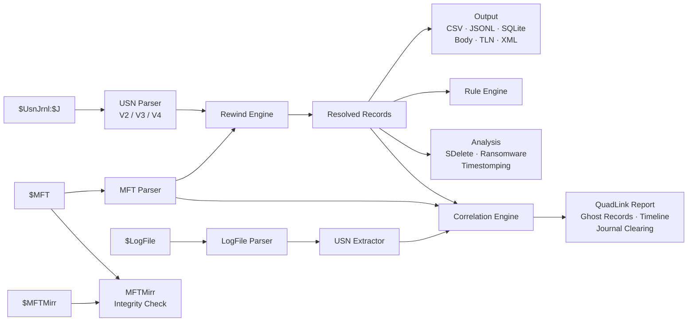

# usnjrnl

The most comprehensive NTFS USN Journal forensic analysis tool. Period.

`usnjrnl` parses `$UsnJrnl:$J` records, reconstructs full file paths through MFT entry reuse, correlates three NTFS artifacts to recover evidence destroyed by anti-forensic tools, and detects attacker activity through built-in forensic rules.

```
$ usnjrnl -j \$J -m \$MFT --mftmirr \$MFTMirr --logfile \$LogFile --csv timeline.csv

[+] 847,293 USN records parsed
[+] 112,448 MFT entries parsed
[+] $MFTMirr is consistent with $MFT
[+] 23 USN records recovered from $LogFile
[!] JOURNAL CLEARING SUSPECTED - ghost records found in $LogFile
[!] 3 potential timestomping indicators
[+] All paths fully resolved (0 UNKNOWN)
```

## Install

```bash
cargo install --git https://github.com/SecurityRonin/usnjrnl
```

Or build from source:

```bash
git clone https://github.com/SecurityRonin/usnjrnl
cd usnjrnl
cargo build --release
```

Runs on Windows, macOS, and Linux. No runtime dependencies.

## Quick Start

Parse a USN journal with full path reconstruction:

```bash
# Basic: parse $UsnJrnl:$J with MFT correlation
usnjrnl -j \$J -m \$MFT --csv output.csv

# Full QuadLink analysis: correlate all four artifacts
usnjrnl -j \$J -m \$MFT --mftmirr \$MFTMirr --logfile \$LogFile --sqlite analysis.db

# Detect timestomping
usnjrnl -j \$J -m \$MFT --detect-timestomping

# All output formats at once
usnjrnl -j \$J -m \$MFT --csv out.csv --jsonl out.jsonl --sqlite out.db --body out.body --tln out.tln --xml out.xml
```

## Why This Tool Exists

Every USN journal parser on the market has blind spots. MFTECmd produces "UNKNOWN" parent paths when MFT entries get reused. ntfs-linker requires C++ compilation and has no maintained builds. NTFS Log Tracker runs only on Windows. No single tool combines all the techniques documented in academic research and DFIR blog posts.

`usnjrnl` closes every gap. It implements the CyberCX Rewind algorithm for 100% path resolution, four-artifact QuadLink correlation (extending David Cowen's TriForce with $MFTMirr integrity verification), and adds forensic detection capabilities that no existing tool provides.

## Feature Comparison

How `usnjrnl` compares against every notable USN journal tool, past and present.

### Parsing & Filesystem Support

| Feature | usnjrnl | MFTECmd | ANJP | ntfs-linker | NTFS Log Tracker | dfir_ntfs | CyberCX Rewind |
|---------|:-------:|:-------:|:----:|:-----------:|:----------------:|:---------:|:--------------:|
| USN V2 parsing | Yes | Yes | Yes | Yes | Yes | Yes | Via MFTECmd |
| USN V3 parsing | Yes | Yes | No | No | No | Yes | No |
| USN V4 parsing | Yes | No | No | No | No | Yes | No |
| ReFS support | Yes | No | No | No | No | No | No |

### Path Resolution & Correlation

| Feature | usnjrnl | MFTECmd | ANJP | ntfs-linker | NTFS Log Tracker | dfir_ntfs | CyberCX Rewind |
|---------|:-------:|:-------:|:----:|:-----------:|:----------------:|:---------:|:--------------:|
| **Artifacts analyzed** | **4** | **1** | **3** | **3** | **3** | **3** | **1** |
| MFT path resolution | Yes | Yes | Yes | Yes | Yes | Yes | Via MFTECmd |
| Rewind (reused MFT entries) | Yes | No | No | No | No | No | Yes |
| $LogFile USN extraction | Yes | No | Yes | Yes | Yes | Yes | No |
| TriForce correlation | Yes | No | Yes | Yes | Partial | Partial | No |
| Ghost record recovery | Yes | No | No | No | No | No | No |
| $MFTMirr integrity check | Yes | No | No | No | No | No | No |

> `usnjrnl` is the only tool that analyzes all four NTFS artifacts ($UsnJrnl + $MFT + $LogFile + $MFTMirr). We call this **QuadLink** correlation. It builds on David Cowen's TriForce (2013), which correlates three artifacts, and adds $MFTMirr byte-level integrity verification to detect tampering with critical system metadata.

### Forensic Detection

| Feature | usnjrnl | MFTECmd | ANJP | ntfs-linker | NTFS Log Tracker | dfir_ntfs | CyberCX Rewind |
|---------|:-------:|:-------:|:----:|:-----------:|:----------------:|:---------:|:--------------:|
| Timestomping detection | Yes | No | No | Basic | Basic | No | No |
| Anti-forensics detection | Yes | No | No | No | Basic | No | No |
| Ransomware pattern detection | Yes | No | No | No | No | No | No |
| USN record carving | Yes | No | No | No | Yes | No | No |
| Custom rule engine | Yes | No | No | No | No | No | No |

### Performance & Monitoring

| Feature | usnjrnl | MFTECmd | ANJP | ntfs-linker | NTFS Log Tracker | dfir_ntfs | CyberCX Rewind |
|---------|:-------:|:-------:|:----:|:-----------:|:----------------:|:---------:|:--------------:|
| Parallel processing | Yes | No | No | No | No | No | No |
| Real-time monitoring | Yes | No | No | No | No | No | No |

### Output Formats

| Feature | usnjrnl | MFTECmd | ANJP | ntfs-linker | NTFS Log Tracker | dfir_ntfs | CyberCX Rewind |
|---------|:-------:|:-------:|:----:|:-----------:|:----------------:|:---------:|:--------------:|
| CSV | Yes | Yes | No | No | Yes | Yes | No |
| JSON/JSONL | Yes | Yes | No | No | No | Yes | No |
| SQLite | Yes | No | Yes | Yes | Yes | No | Yes |
| Sleuthkit body | Yes | Yes | No | No | No | No | No |
| TLN | Yes | No | No | No | No | No | No |
| XML | Yes | No | No | No | No | No | No |

### Platform & Implementation

| | usnjrnl | MFTECmd | ANJP | ntfs-linker | NTFS Log Tracker | dfir_ntfs | CyberCX Rewind |
|---------|:-------:|:-------:|:----:|:-----------:|:----------------:|:---------:|:--------------:|
| Cross-platform | Yes | Yes | Windows | Linux | Windows | Yes | Yes |
| Language | Rust | C# (.NET) | C++ | C++ | C# | Python | Python |
| Open source | Yes | Yes | No | Yes | No | Yes | Yes |
| Maintained (2024+) | Yes | Yes | No | No | No | Yes | Yes |

### Summary

| | usnjrnl | MFTECmd | ANJP | ntfs-linker | NTFS Log Tracker | dfir_ntfs | CyberCX Rewind |
|---------|:-------:|:-------:|:----:|:-----------:|:----------------:|:---------:|:--------------:|
| **Feature count** | **23/23** | **6/23** | **4/23** | **5/23** | **6/23** | **7/23** | **3/23** |

Feature count includes all rows from Parsing, Path Resolution, Forensic Detection, Performance, and Output sections. Partial/Basic counts as half.

## Features

### Path Reconstruction with Journal Rewind

Standard tools resolve parent directory references against the current MFT state. When Windows reuses an MFT entry number (assigns it to a new file), those references break. The result: "UNKNOWN" parent paths scattered throughout your timeline.

The Rewind algorithm, first described by [CyberCX](https://cybercx.com.au/blog/ntfs-usnjrnl-rewind/), processes journal entries in reverse chronological order. It tracks every (entry, sequence) to (filename, parent) mapping, rebuilding the directory tree as it existed at each point in time. The result: zero unknown paths.

```
Before Rewind:  UNKNOWN\UNKNOWN\malware.exe
After Rewind:   .\Users\admin\AppData\Local\Temp\malware.exe
```

### QuadLink Correlation

`usnjrnl` correlates four NTFS artifacts — more than any other tool:

1. **$UsnJrnl** records file creates, deletes, renames, and data changes
2. **$MFT** stores the current file system state with timestamps
3. **$LogFile** contains transaction logs that embed USN records
4. **$MFTMirr** mirrors the first four critical MFT entries for integrity verification

This builds on the [TriForce](https://www.hecfblog.com/2013/01/ntfs-triforce-deeper-look-inside.html) technique (David Cowen, 2013), which pioneered three-artifact correlation of $MFT + $LogFile + $UsnJrnl. `usnjrnl` implements the full TriForce approach and adds $MFTMirr as a fourth artifact: a byte-level comparison between $MFT and its mirror that detects tampering with critical system metadata entries ($MFT, $MFTMirr, $LogFile, $Volume) — a consistency check no other tool performs.

When an attacker clears the USN journal, the $LogFile still contains copies of recent USN records in its RCRD pages. `usnjrnl` extracts these embedded records, cross-references them against the journal, and flags the difference as "ghost records" — proof of activity the attacker tried to erase.

```
[+] 23 USN records recovered from $LogFile
[!] JOURNAL CLEARING SUSPECTED - ghost records found in $LogFile
[!] Ghost records (evidence of cleared journal entries):
    LSN=48201 USN=1024 2024-01-15T03:42:11Z [FILE_CREATE] mimikatz.exe
    LSN=48205 USN=1088 2024-01-15T03:42:12Z [FILE_DELETE|CLOSE] mimikatz.exe

[+] $MFTMirr is consistent with $MFT
```

Or when tampering is detected:

```
[!] $MFTMirr INCONSISTENCY DETECTED:
    Entry 2 ($LogFile): 14 byte differences
```

### Anti-Forensics Detection

Built-in detectors identify four categories of suspicious activity:

**Secure Deletion** (SDelete, CCleaner): Detects the file renaming pattern these tools use before deletion. SDelete renames files to sequences of repeated characters (AAAA, BBBB, ..., ZZZZ) before zeroing and deleting them.

**Journal Clearing**: Flags gaps in $LogFile pages and ghost records that indicate `fsutil usn deletejournal` or similar commands.

**Ransomware**: Identifies mass file rename/delete patterns with known ransomware extensions (.encrypted, .locked, .crypto) within short time windows.

**Timestomping**: Cross-validates $STANDARD_INFORMATION timestamps against $FILE_NAME timestamps and USN journal FILE_CREATE events. When SI_Created predates the journal's first record for that file, the timestamp was backdated.

### Custom Rule Engine

Define your own detection rules matching on filenames, extensions, reason flags, or combinations:

```rust
use usnjrnl::rules::{Rule, RuleSet, Severity, FilenameMatch};
use usnjrnl::usn::UsnReason;

let mut rules = RuleSet::with_builtins(); // 5 pre-loaded forensic rules

rules.add_rule(Rule {
    name: "lateral_movement_tools".into(),
    description: "Known lateral movement binaries".into(),
    severity: Severity::Critical,
    filename_match: Some(FilenameMatch::Regex(
        r"(?i)(psexec|wmiexec|smbexec|atexec)".into()
    )),
    exclude_pattern: None,
    any_reasons: Some(UsnReason::FILE_CREATE),
    all_reasons: None,
});
```

Built-in rules detect:
- Offensive tools (mimikatz, psexec, procdump, lazagne, rubeus, sharphound)
- Ransomware file extensions
- SDelete secure deletion patterns
- Script execution (.ps1, .vbs, .bat, .cmd, .js)
- Credential access (ntds.dit, SAM, SECURITY, SYSTEM)

### ReFS Support

ReFS volumes use 128-bit file reference numbers instead of NTFS's 48+16 bit format. `usnjrnl` preserves the full 128-bit identifiers, detects ReFS volumes automatically from V3 record patterns, and reconstructs paths using journal-only rewind (ReFS has no traditional MFT to seed from).

### Parallel Processing

For large journals (500MB+), `usnjrnl` splits the data into chunks and parses them across all CPU cores using rayon. Results merge in USN offset order for deterministic output.

### Real-Time Monitoring

The monitoring module provides a `JournalSource` trait for polling live USN journals on Windows. It tracks the last-read USN position, detects journal wraps, and emits structured events for each new record.

```rust
use usnjrnl::monitor::{JournalMonitor, MonitorConfig, MonitorEvent};

// Your JournalSource implementation reads from FSCTL_READ_USN_JOURNAL
let monitor = JournalMonitor::new(source, MonitorConfig::default())?;
for event in monitor.poll_once() {
    match event {
        MonitorEvent::NewRecord(record) => { /* process */ },
        MonitorEvent::JournalWrap { old_usn, new_usn } => { /* handle wrap */ },
        MonitorEvent::Error(msg) => { /* log error */ },
    }
}
```

## Output Formats

| Format | Flag | Description |
|--------|------|-------------|
| CSV | `--csv` | MFTECmd-compatible columns |
| JSON Lines | `--jsonl` | One JSON object per line |
| SQLite | `--sqlite` | Indexed database with USNJRNL_FullPaths and MFT tables |
| Sleuthkit body | `--body` | Pipe-delimited, feeds into `mactime` and `log2timeline` |
| TLN | `--tln` | 5-field pipe-delimited timeline format |
| XML | `--xml` | Structured XML with full record fields |

All formats include: timestamp, USN offset, MFT entry/sequence, parent entry/sequence, resolved parent path, filename, extension, file attributes, reason flags, source info, security ID, and record version.

## Architecture



Modules:
- `usn`: Binary parsing of USN_RECORD_V2, V3, V4 with streaming and parallel modes
- `mft`: $MFT entry extraction with SI/FN timestamp pairs
- `rewind`: CyberCX Rewind algorithm for path reconstruction
- `logfile`: $LogFile RCRD page analysis and embedded USN extraction
- `mftmirr`: $MFTMirr integrity verification
- `correlation`: QuadLink engine linking all four artifacts
- `analysis`: Anti-forensics detection (secure delete, ransomware, timestomping, journal clearing)
- `rules`: Pattern-matching rule engine with glob, regex, and reason flag conditions
- `refs`: ReFS 128-bit file ID handling
- `monitor`: Real-time journal polling abstraction
- `output`: CSV, JSONL, SQLite, Sleuthkit body, TLN, XML exporters

## Testing

271 unit tests covering every module. Run with:

```bash
cargo test
```

## References

- [CyberCX: Rewriting the USN Journal](https://cybercx.com.au/blog/ntfs-usnjrnl-rewind/) (Rewind algorithm)
- [NTFS TriForce](https://www.hecfblog.com/2013/01/ntfs-triforce-deeper-look-inside.html) (David Cowen, $MFT + $LogFile + $UsnJrnl correlation)
- [ntfs-linker](https://github.com/strozfriedberg/ntfs-linker) (Stroz Friedberg, $LogFile USN extraction)
- [MFTECmd](https://github.com/EricZimmerman/MFTECmd) (Eric Zimmerman, MFT/USN parsing)
- [dfir_ntfs](https://github.com/msuhanov/dfir_ntfs) (Maxim Suhanov, Python NTFS parser)
- [Microsoft USN_RECORD_V2](https://learn.microsoft.com/en-us/windows/win32/api/winioctl/ns-winioctl-usn_record_v2)
- [Microsoft USN_RECORD_V3](https://learn.microsoft.com/en-us/windows/win32/api/winioctl/ns-winioctl-usn_record_v3)
- [Microsoft USN_RECORD_V4](https://learn.microsoft.com/en-us/windows/win32/api/winioctl/ns-winioctl-usn_record_v4)
- [Forensic Analysis of ReFS Journaling](https://dfrws.org/wp-content/uploads/2021/01/2021_APAC_paper-forensic_analysis_of_refs_journaling.pdf) (DFRWS APAC 2021)

## Author

**Albert Hui** ([@SecurityRonin](https://github.com/SecurityRonin))

Digital forensics practitioner and tool developer. Building open-source DFIR tools that close the gaps left by commercial software.

## License

MIT
