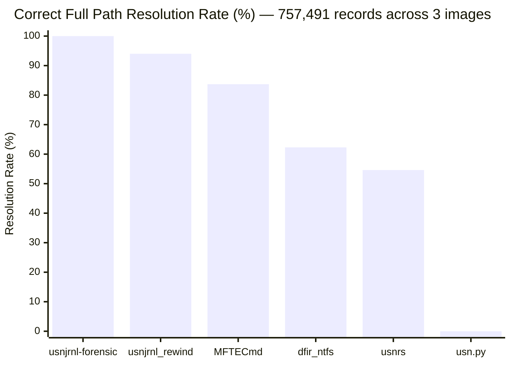

# Validation Report

Record-level comparison of `usnjrnl-forensic` against **MFTECmd** (Eric Zimmerman), **usnjrnl_rewind** (Yogesh Khatri / CyberCX), **usn.py** (PoorBillionaire), **dfir_ntfs** (Maxim Suhanov), **usnrs** (Airbus CERT), and **Velociraptor** (Rapid7) using three publicly available forensic disk images.

Every USN record is compared by Update Sequence Number — not sampled.

## Test Environment

| Component | Version | Source |
|-----------|---------|--------|
| usnjrnl-forensic | 0.1.4 | [crates.io](https://crates.io/crates/usnjrnl-forensic) |
| [MFTECmd](https://github.com/EricZimmerman/MFTECmd) | 1.3.0.0 (.NET 9) | [GitHub Releases](https://github.com/EricZimmerman/MFTECmd/releases) |
| [usn.py](https://github.com/PoorBillionaire/USN-Journal-Parser) (usnparser) | 4.1.5 | `pip3 install usnparser` |
| [dfir_ntfs](https://github.com/msuhanov/dfir_ntfs) (ntfs_parser) | 1.1.20 | `pip3 install git+https://github.com/msuhanov/dfir_ntfs.git` |
| [usnrs](https://github.com/airbus-cert/usnrs) (usnrs-cli) | 0.5.0 | `cargo install --git https://github.com/airbus-cert/usnrs --features usnrs-cli` |
| [usnjrnl_rewind](https://github.com/CyberCX-DFIR/usnjrnl_rewind) | 0.6 (`cec4dca`) | `git clone https://github.com/CyberCX-DFIR/usnjrnl_rewind.git` |
| [Velociraptor](https://github.com/Velocidex/velociraptor) | 0.74.5 | [GitHub Releases](https://github.com/Velocidex/velociraptor/releases) |
| [The Sleuth Kit](https://github.com/sleuthkit/sleuthkit) (icat, fls, mmls) | 4.12.1 | `brew install sleuthkit` |
| Rust (rustc) | 1.88.0 (6b00bc388) | [rustup.rs](https://rustup.rs/) |
| .NET Runtime | 10.0.103 | [dotnet.microsoft.com](https://dotnet.microsoft.com/download) |
| Python | 3.11.14 | `brew install python@3.11` |
| Platform | macOS Darwin 24.6.0, arm64 (Apple Silicon) | — |

## Test Images

### 1. Szechuan Sauce (DESKTOP-SDN1RPT)

| Property | Value |
|----------|-------|
| Challenge | [The Stolen Szechuan Sauce](https://dfirmadness.com/the-stolen-szechuan-sauce/) (James Smith) |
| Catalog | [CFREDS — HackTheBox / SzechuanSauce](https://cfreds.nist.gov/all/HackTheBox/SzechuanSauce) |
| Download | [The Evidence Locker](https://theevidencelocker.github.io/) (Kevin Pagano) |
| Filename | `20200918_0417_DESKTOP-SDN1RPT.E01` through `.E04` |
| Format | EWF v1, multi-segment (E01-E04) |
| Media size | 16,106,127,360 bytes (15.0 GiB) |
| `$MFT` | 107,479,040 bytes (102.5 MB) |
| `$UsnJrnl:$J` | 27,209,456 bytes (25.9 MB) |

### 2. MaxPowers C Drive

| Property | Value |
|----------|-------|
| Challenge | [MUS CTF 2018](https://www.youracclaim.com/org/magnet-forensics/badge/magnet-user-summit-ctf-2018) (David Cowen & Matt Seyer) |
| Catalog | [CFREDS — AcademicChallenges / MaxPowers](https://cfreds.nist.gov/all/AcademicChallenges/MaxPowers) |
| Download | [The Evidence Locker](https://theevidencelocker.github.io/) (Kevin Pagano) |
| Filename | `MaxPowersCDrive.E01` |
| Format | linen 5, single segment |
| Media size | 53,687,091,200 bytes (50.0 GiB) |
| `$MFT` | 302,252,032 bytes (288.2 MB) |
| `$UsnJrnl:$J` | 1,465,037,896 bytes (1.4 GB) |

### 3. PC-MUS-001

| Property | Value |
|----------|-------|
| Challenge | [MUS CTF 2019](https://aboutdfir.com/education/challenges-ctfs/) (David Cowen) |
| Catalog | [CFREDS](https://cfreds.nist.gov/) |
| Download | [The Evidence Locker](https://theevidencelocker.github.io/) (Kevin Pagano) |
| Filename | `PC-MUS-001.E01` |
| Format | EWF v1, single segment |
| Media size | 256,060,514,304 bytes (238.5 GiB) |
| `$MFT` | 531,890,176 bytes (507.2 MB) |
| `$UsnJrnl:$J` | 846,561,440 bytes (807.3 MB) |

Artifacts extracted using the `ewf` crate (v0.1.1) with NTFS partition detection and MFT-based file extraction.

## Reference Tools

### [MFTECmd](https://github.com/EricZimmerman/MFTECmd) (Eric Zimmerman)

Industry-standard .NET tool for parsing NTFS artifacts. Parses `$UsnJrnl:$J` directly and outputs CSV with full record details including USN offset, timestamp, reason flags, file attributes, and MFT references. Supports an optional `-m` flag to provide the `$MFT` for parent path resolution via point-in-time MFT lookup.

```
dotnet MFTECmd.dll -f '$UsnJrnl_$J' -m '$MFT' --csv output/ --csvf mftecmd.csv
```

### [usn.py](https://github.com/PoorBillionaire/USN-Journal-Parser) (PoorBillionaire)

Python-based USN journal parser. Outputs CSV with timestamp, filename, file attributes, and reason flags.

```
usn.py --csv -f '$UsnJrnl_$J' -o usnpy.csv
```

### [dfir_ntfs](https://github.com/msuhanov/dfir_ntfs) (Maxim Suhanov)

Python library and CLI (`ntfs_parser`) for parsing NTFS artifacts. Its `--usn` mode combines the `$MFT` and `$UsnJrnl:$J` to produce a CSV with USN values, reason flags, timestamps, filenames, and file paths resolved via point-in-time MFT lookup.

```
ntfs_parser --usn '$MFT' '$UsnJrnl_$J' output.csv
```

### [usnrs](https://github.com/airbus-cert/usnrs) (Airbus CERT)

Rust-based USN journal parser from Airbus CERT. The CLI (`usnrs-cli`) supports an optional `--mft` flag for path resolution via MFT lookup.

```
usnrs-cli --csv -o output.csv --mft '$MFT' '$UsnJrnl_$J'
```

### [usnjrnl_rewind](https://github.com/CyberCX-DFIR/usnjrnl_rewind) (CyberCX)

Python post-processing script that implements the [Rewind algorithm](https://cybercx.com.au/blog/ntfs-usnjrnl-rewind/) (Yogesh Khatri, CyberCX). It takes MFTECmd CSV output as input and reconstructs full paths by walking the journal in reverse chronological order. This is a proof-of-concept — not a standalone parser. It requires MFTECmd to be run first, producing two CSV files (one for `$UsnJrnl:$J`, one for `$MFT`). Output is CSV or SQLite.

`usnjrnl-forensic` implements the same Rewind algorithm natively in Rust with no external tool dependency. Key differences:

| | usnjrnl-forensic | usnjrnl_rewind |
|--|------------------|----------------|
| Standalone parser | Yes — parses raw `$UsnJrnl:$J` and `$MFT` directly | No — requires MFTECmd CSV as input |
| External dependencies | None | MFTECmd (.NET) |
| USN versions | V2, V3, V4 | Via MFTECmd (V2, V3) |
| Output formats | CSV, JSONL, SQLite, body, TLN, XML | CSV, SQLite |
| Additional analysis | Timestomping, $LogFile correlation, $MFTMirr integrity, rule engine, USN carving | Path resolution only |
| Automated tests | 388 unit tests | None |
| Language | Rust (compiled) | Python |

```
# Extract artifacts with The Sleuth Kit
mmls image.E01                    # find NTFS partition offset
icat -o <offset> image.E01 0 > '$MFT'
icat -o <offset> image.E01 <usnjrnl_inode>-128-3 > '$J'

# Produce MFTECmd CSVs (required input for usnjrnl_rewind)
dotnet MFTECmd.dll -f '$MFT' --csv . --csvf mft.csv
dotnet MFTECmd.dll -f '$J' --csv . --csvf usnjrnl.csv

# Run usnjrnl_rewind
python3 usnjrnl_rewind.py -u usnjrnl.csv -m mft.csv output_dir/
```

### [Velociraptor](https://github.com/Velocidex/velociraptor)

Velociraptor (v0.74.5, macOS arm64) supports `parse_usn()` with `usn_filename` and `mft_filename` parameters for offline analysis. However, its parser cannot handle extracted sparse `$J` files — it reads the first data cluster, parses a few valid records, then stops at the first large zero-filled gap. Against the Szechuan Sauce `$UsnJrnl:$J` (43,463 records), Velociraptor returned only 2 valid records.

```
velociraptor query 'SELECT * FROM parse_usn(
    usn_filename="/path/to/$UsnJrnl_$J",
    mft_filename="/path/to/$MFT",
    accessor="file")'
```

## Results

### Record Counts

| Image | usnjrnl-forensic | MFTECmd | usn.py | dfir_ntfs | usnrs |
|-------|-----------------|---------|--------|-----------|-------|
| Szechuan Sauce | 43,463 | 43,463 | 43,463 | 43,463 | 43,463 |
| MaxPowers | 333,135 | 333,135 | 333,135 | 333,135 | 333,135 |
| PC-MUS-001 | 380,893 | 380,893 | 380,893 | 380,893 | 380,893 |
| **Total** | **757,491** | **757,491** | **757,491** | **757,491** | **757,491** |

All five tools produce identical record counts across all three images.

**Velociraptor** was excluded from this table. Its offline `parse_usn()` cannot handle extracted sparse `$J` files — it reads the first data cluster, parses a few valid records, then stops at the first large zero-filled gap. Against the Szechuan Sauce image (43,463 records), Velociraptor returned only 2 valid records. The remaining images were not tested as the parser fundamentally cannot process sparse journal files offline.

### USN Offset Comparison

For each image, all Update Sequence Numbers were extracted from both `usnjrnl-forensic` and MFTECmd outputs, sorted numerically, and compared with `diff`. **Zero differences across all three images** — every USN offset in our output exists in MFTECmd's output, and vice versa.

### Path Resolution: Rewind Algorithm vs Point-in-Time MFT Lookup

Three of the tested tools — MFTECmd, dfir_ntfs, and usnrs — support parent path resolution by looking up the parent MFT entry number in the current `$MFT`. This is a **point-in-time lookup**: it resolves correctly only if the parent directory's MFT entry still refers to the original directory. When an MFT entry has been reallocated (a deleted directory's entry reused for a different file), the lookup fails.

The [Rewind algorithm](https://cybercx.com.au/blog/ntfs-usnjrnl-rewind/) (Yogesh Khatri, CyberCX) takes a different approach: it walks the USN journal chronologically, tracking directory creates, renames, and deletes to maintain a historical parent-child map. This resolves paths even when parent directories were later deleted and their MFT entries recycled. The original CyberCX [proof-of-concept](https://github.com/CyberCX-DFIR/usnjrnl_rewind) is a Python script that post-processes MFTECmd CSV output; `usnjrnl-forensic` implements the algorithm natively in Rust with no external tool dependency.

| Image | Records | usnjrnl-forensic | usnjrnl_rewind | MFTECmd | dfir_ntfs | usnrs |
|-------|---------|------------------|----------------|---------|-----------|-------|
| Szechuan Sauce | 43,463 | 43,463 (100%) | 43,452 (99.97%) | 33,002 (75.9%) | 27,671 (63.7%) | 26,011 (59.8%) |
| MaxPowers | 333,135 | 333,135 (100%) | 300,115 (90.1%) | 264,415 (79.4%) | 200,038 (60.0%) | 186,186 (55.9%) |
| PC-MUS-001 | 380,893 | 380,893 (100%) | 368,173 (96.7%) | 336,575 (88.4%) | 243,824 (64.0%) | 201,343 (52.9%) |
| **Total** | **757,491** | **757,491 (100%)** | **711,740 (94.0%)** | **633,992 (83.7%)** | **471,533 (62.3%)** | **413,540 (54.6%)** |

Across 757,491 records from three real forensic images:

- **usnjrnl-forensic** resolved 757,491 of 757,491 records to correct full paths (100%)
- **usnjrnl_rewind** resolved 711,740 of 757,491 records to correct full paths (94.0%) — the remaining 45,751 paths are incorrect due to retroactive rename application and ADS name inclusion (see [details below](#usnjrnl_rewind-path-resolution-bugs))
- **MFTECmd** resolved 633,992 of 757,491 records (83.7%) — returned `PathUnknown` for 123,499
- **dfir_ntfs** resolved 471,533 of 757,491 records (62.3%) — returned empty paths for 285,958
- **usnrs** resolved 413,540 of 757,491 records (54.6%) — returned filename-only for 343,951

**usn.py** does not support path resolution at all — its CSV output contains only `timestamp`, `filename`, `fileattr`, and `reason` with no parent path column. **Velociraptor** supports path resolution via `mft_filename`, but its offline parser only returned 2 records and cannot be meaningfully compared.

`usnjrnl-forensic` is the only tool tested that provides correct full path resolution for every record.

#### Path Resolution Comparison



#### Examples

Below are representative records where point-in-time MFT lookup fails because the parent directory's MFT entry was reallocated after the original directory was deleted. Tools handle this failure differently:

- **MFTECmd** checks the MFT entry sequence number against the USN record's parent reference. When they don't match, it returns `PathUnknown` — an honest admission that the path cannot be resolved.
- **dfir_ntfs** and **usnrs** do not check sequence numbers. They resolve to whatever currently occupies the MFT entry, producing a **silently incorrect path** — a worse failure mode than `PathUnknown`, because the analyst has no indication the path is wrong.
- **usnjrnl_rewind** uses the Rewind algorithm but applies renames retroactively (see root cause below), producing incorrect paths when the parent directory was renamed between the event and the end of the journal.
- **usnjrnl-forensic** uses the Rewind algorithm with correct chronological scoping, reconstructing the path as it existed at the time of each event.

**Szechuan Sauce** — File: `content.phf` (USN 22120200, FILE_CREATE, parent MFT entry 86780 seq 9)

| Tool | Parent Path | Correct Full Path |
|------|-------------|----------|
| usnjrnl-forensic | `.\Windows\ServiceProfiles\NetworkService\AppData\Local\Microsoft\Windows\DeliveryOptimization\Cache\e4622eecf4cef8d28ec1969654794692c968a961` | Yes |
| usnjrnl_rewind | `.\Windows\ServiceProfiles\NetworkService\AppData\Local\Microsoft\Windows\DeliveryOptimization\Cache\e4622eecf4cef8d28ec1969654794692c968a961` | Yes |
| MFTECmd | `.\PathUnknown\Directory with ID 0x000152FC-00000009` | No |
| dfir_ntfs | *(empty)* | No |
| usnrs | `content.phf` *(filename only)* | No |

**Szechuan Sauce** — File: `AgentPlaceholder.png` (USN 22257480, SECURITY_CHANGE, parent MFT entry 250 seq 1)

| Tool | Parent Path | Correct Full Path |
|------|-------------|----------|
| usnjrnl-forensic | `.\Program Files\WindowsApps\Microsoft.GetHelp_10.1706.13331.0_x64__8wekyb3d8bbwe\Assets` | Yes |
| usnjrnl_rewind | `.\Program Files\WindowsApps\Microsoft.GetHelp_10.1706.13331.0_x64__8wekyb3d8bbwe6eea7c0a-406b-4ef5-8479-7482f9705336\Assets` | **Wrong** |
| MFTECmd | `.\PathUnknown\Directory with ID 0x000000FA-00000001` | No |
| dfir_ntfs | `.\Program Files\WindowsApps\Microsoft.GetHelp_10.2004.31291.0_x64__8wekyb3d8bbwe\Assets` | **Wrong** |
| usnrs | `Program Files\WindowsApps\Microsoft.GetHelp_10.2004.31291.0_x64__8wekyb3d8bbwe\Assets\AgentPlaceholder.png` | **Wrong** |

Note the version number difference: the event occurred when `Microsoft.GetHelp` was at version `10.1706.13331.0`. By the time the MFT was captured, MFT entry 250 had been reallocated to the newer `10.2004.31291.0` version. MFTECmd correctly reports `PathUnknown`. dfir_ntfs and usnrs silently return the wrong version. usnjrnl_rewind returns the correct version but with a staging GUID (`6eea7c0a-406b-...`) that was not appended until USN 23,489,328 — over 1.2M bytes after this event. An analyst using usnjrnl_rewind would look for a directory name that never existed at the time of this event.

**MaxPowers** — File: `CL_Utility.ps1` (USN 1428280528, FILE_CREATE, parent MFT entry 2058 seq 17)

| Tool | Parent Path | Correct Full Path |
|------|-------------|----------|
| usnjrnl-forensic | `.\Windows\Temp\SDIAG_8e0546f4-e6d9-467c-8529-c7cb7bd3c437` | Yes |
| usnjrnl_rewind | `.\Windows\Temp\SDIAG_8e0546f4-e6d9-467c-8529-c7cb7bd3c437` | Yes |
| MFTECmd | `.\PathUnknown\Directory with ID 0x0000080A-00000011` | No |
| dfir_ntfs | *(empty)* | No |
| usnrs | `CL_Utility.ps1` *(filename only)* | No |

**PC-MUS-001** — File: `BIT2860.tmp` (USN 805870216, FILE_CREATE, parent MFT entry 30642 seq 2)

| Tool | Parent Path | Correct Full Path |
|------|-------------|----------|
| usnjrnl-forensic | `.\Users\borch\AppData\Local\Temp\chrome_BITS_7300_492499470` | Yes |
| usnjrnl_rewind | `.\Users\borch\AppData\Local\Temp\chrome_BITS_7300_492499470` | Yes |
| MFTECmd | `.\PathUnknown\Directory with ID 0x000077B2-00000002` | No |
| dfir_ntfs | *(empty)* | No |
| usnrs | `BIT2860.tmp` *(filename only)* | No |

**PC-MUS-001** — File: `th[1].jpg` (USN 805900592, FILE_CREATE, parent MFT entry 1621 seq 5)

| Tool | Parent Path | Correct Full Path |
|------|-------------|----------|
| usnjrnl-forensic | `.\Users\borch\AppData\Local\Packages\MicrosoftWindows.Client.CBS_cw5n1h2txyewy\AC\INetCache\6UNECTZR` | Yes |
| usnjrnl_rewind | `.\Users\borch\AppData\Local\Packages\MicrosoftWindows.Client.CBS_cw5n1h2txyewy\AC\INetCache\6UNECTZR` | Yes |
| MFTECmd | `.\PathUnknown\Directory with ID 0x00000655-00000005` | No |
| dfir_ntfs | *(empty)* | No |
| usnrs | `th[1].jpg` *(filename only)* | No |

In each case, the parent directory's MFT entry was reallocated to a different file after the original directory was deleted. Point-in-time MFT lookup either fails honestly (MFTECmd's `PathUnknown`), fails silently with the wrong path (dfir_ntfs and usnrs), or returns no path at all. usnjrnl_rewind resolves most paths correctly but applies renames retroactively — producing incorrect paths when the parent directory was renamed between the event and the end of the journal (see AgentPlaceholder.png above).

#### usnjrnl_rewind Path Resolution Bugs

Record-by-record comparison against `usnjrnl-forensic` across all three images, verified against the journal's own rename events:

| Image | Records | Correct Paths (usnjrnl_rewind) | Incorrect Paths |
|-------|---------|-------------------------------|-----------------|
| Szechuan Sauce | 43,463 | 43,452 (99.97%) | 11 |
| MaxPowers | 333,135 | 300,115 (90.09%) | 33,020 |
| PC-MUS-001 | 380,893 | 368,173 (96.66%) | 12,720 |
| **Total** | **757,491** | **711,740 (94.0%)** | **45,751** |

Two bugs account for all 45,751 incorrect paths:

1. **ADS names in directory paths** — usnjrnl_rewind includes NTFS alternate data stream identifiers as path components (e.g., `Microsoft Office:Win32App_1` instead of `Microsoft Office`, `OneDrive:${GUID}.SyncRootIdentity` instead of `OneDrive`). ADS names are metadata about the directory entry, not filesystem path components.
2. **Retroactive rename application** — usnjrnl_rewind applies directory renames to records that occurred *before* the rename. For example, the directory `_8wekyb3d8bbwe` was renamed to `_8wekyb3d8bbwe6eea7c0a-406b-...` at USN 23,489,328, but usnjrnl_rewind uses the post-rename name for events at USN 22,257,480. Similarly, `WSAA` was recycled to `$R6CHL9I` at USN 820,975,808, but usnjrnl_rewind uses the Recycle Bin name for events at USN 818,716,760.

**Root cause:** usnjrnl_rewind processes the journal in reverse order (newest to oldest) and accumulates directory renames without scoping them chronologically. When it encounters a rename (e.g., `WSAA → $R6CHL9I`), it applies the new name to *all* events referencing that MFT entry — including earlier events where the directory still had its original name. `usnjrnl-forensic` walks the journal forward, applying each rename only to events *after* the rename, which is the correct interpretation of the [Rewind algorithm](https://cybercx.com.au/blog/ntfs-usnjrnl-rewind/).

## How to Reproduce

1. Download E01 images from [The Evidence Locker](https://theevidencelocker.github.io/)
2. Extract NTFS artifacts with The Sleuth Kit:
   ```
   mmls image.E01                                          # find NTFS partition offset
   icat -o <offset> image.E01 0 > '$MFT'                  # MFT is always inode 0
   fls -o <offset> image.E01 11                            # list $Extend to find $UsnJrnl inode
   icat -o <offset> image.E01 <usnjrnl_inode>-128-3 > '$J' # extract $UsnJrnl:$J data stream
   ```
3. Run usnjrnl-forensic:
   ```
   usnjrnl-forensic -j '$J' -m '$MFT' --csv ours.csv --stats
   ```
4. Run MFTECmd (with `-m` for path resolution comparison):
   ```
   dotnet MFTECmd.dll -f '$J' -m '$MFT' --csv . --csvf mftecmd_usnjrnl.csv
   dotnet MFTECmd.dll -f '$MFT' --csv . --csvf mftecmd_mft.csv
   ```
5. Run usnjrnl_rewind (requires MFTECmd CSVs from step 4):
   ```
   python3 usnjrnl_rewind.py -u mftecmd_usnjrnl.csv -m mftecmd_mft.csv output_dir/
   ```
6. Run usn.py:
   ```
   usn.py --csv -f '$J' -o usnpy.csv
   ```
7. Run dfir_ntfs:
   ```
   ntfs_parser --usn '$MFT' '$J' dfir_ntfs.csv
   ```
8. Run usnrs:
   ```
   usnrs-cli --mft '$MFT' '$J' > usnrs.txt
   ```
9. Compare record counts, USN offsets, and resolved paths across all outputs.
